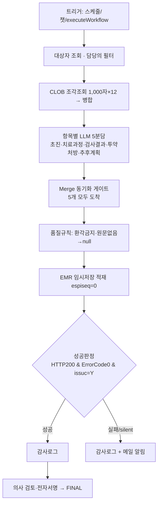

# 입퇴원 요약 AI 초안 자동작성

`n8n` · `LLM` · `Oracle CLOB` · `EMR 임시저장` · AI 활용

| 한 줄 | 재원환자 임상기록을 AI가 항목별 요약해 EMR에 임시저장 초안으로 적재 |
|---|---|
| 역할 | 워크플로우 · 프롬프트 · 적재 연동 **전담 개발** |
| 핵심 역량 | 의료 임상데이터에 대한 안전한 LLM 도입 — 품질통제·환각방지·인적검토 게이트 |
| 상태 | 운영 중 |

> ⚠️ 환자 임상데이터·EMR 인증·양식코드는 어떤 예시도 미포함. LLM은 규칙기반 mock, 데이터는 전부 합성. 아래는 **설계 요소의 재현**.

## 문제
전담간호팀·의료진이 입퇴원 요약·입원초진기록을 임상기록 본문에서 수기로 요약 작성했다.

## 접근
AI가 항목별로 요약해 EMR에 **임시저장 초안**으로 적재. **최종 확정은 반드시 의사 검토·전자서명**(휴먼리뷰 게이트). 응답 성공만으로 적재 성공을 판단하지 않는다.

## 파이프라인


## 핵심 기술 / 안전장치
- **CLOB 조각 분리 조회**로 대용량 본문 조회 제약 우회
- **다중 LLM 병렬 합류 동기화**: Merge 게이트로 5분담 합류 보장
- **품질 규칙**: 환각 금지·원문 충실, "[원문 없음]" → null 정규화, 과다생성 차단
- **silent failure 방지**: 적재 성공을 `HTTP200 + ErrorCode0 + issuc=Y` 3중 조건으로 판정
- 운영 안전: 실행 90분 제한, 테스트 서버 임포트 금지(스케줄 대량적재 방지)

## 실행 가능한 재구현
```bash
cd impl
python summary_pipeline.py     # 요약→적재→성공판정→서명 데모(silent fail 포함)
python -m unittest -v          # 12개: 게이트/품질/성공판정 3중/휴먼리뷰
```
`impl/summary_pipeline.py` — 5분담·Merge 게이트·품질규칙·성공판정 3중조건·감사로그·휴먼리뷰 게이트 재현.

**n8n 워크플로우**: `impl/workflow.demo.json` — 트리거→조회→CLOB병합→LLM 5분담→Merge 게이트(5)→품질규칙→적재→성공판정 3중조건→감사로그/알림 구조의 **import 가능한 합성 워크플로우**.
