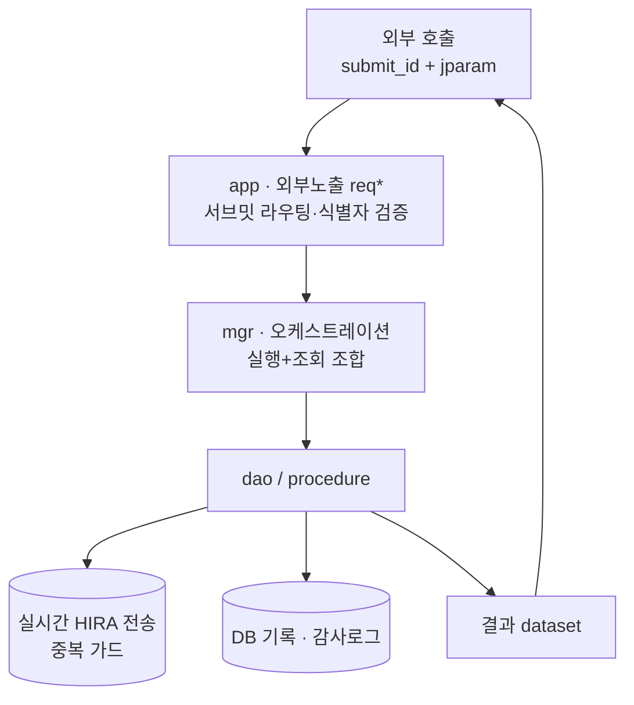
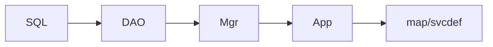

# DUR / 개인투약이력 EMR 외부조회 API

`Java` · `iBatis` · `Oracle/PL-SQL` · 레거시 EMR 컴포넌트 · API 개발

| 한 줄 | 화면(xfdl) 안에 갇힌 DUR·개인투약이력 기능을 재사용 가능한 내부 API로 개방 |
|---|---|
| 역할 | EMR Java 컴포넌트 **신규/수정 직접 개발** |
| 핵심 역량 | 레거시 EMR 내부(서브밋·컴포넌트·DB)까지 안전하게 신규 API 추가 · 정적+실검증 |
| 상태 | 운영 중 |

> ⚠️ 실제 서브밋ID·컴포넌트 경로·서버 URL·프로시저/테이블명·주민번호 미포함. 아래는 **계층 구조와 안전 원칙의 재현**(가상 약품/이력 데이터).

## 문제
EMR 처방화면의 DUR(의약품 안전점검)과 타기관 처방이력이 화면 안에만 존재해, n8n·타 시스템에서 재사용할 수 없었다.

## 접근
화면 기능을 **재사용 가능한 내부 API로 개방**. 기존 스크리닝 서비스를 오케스트레이션하는 전용 컴포넌트를 신규 개발하고, 개인투약이력은 기존 인터페이스 컴포넌트에 메서드/DAO/SQL/맵을 추가.

## 계층 아키텍처


## 반영 순서 (비대칭 커밋 위험 차단)


## 핵심 기술 / 안전장치
- 기존 스크리닝 서비스 재사용(실행 + 조회 조합), 입력 12파라미터·출력 커서/상세 매핑
- classpath 문제(`org.json.simple` 부재) → **gson 전환**
- **정적검증 반영**: null 방어 · 주민번호 유효성 사전차단 · 파라미터 key 중복 제거
- **부수효과 가드**: 실시간 HIRA 중복 전송 방지(dedup key)
- 크리덴셜/주민번호는 **로컬 변수로만, 로그·감사로그 미출력**(요청식별자만 보존)
- "BUILD SUCCESSFUL ≠ 정합" → 실호출 + DB 재조회 검증
- 배포: 본체+config+map+build 한 묶음 커밋 → ant 빌드 → WAS 재기동 → 카나리 1건 → DB 검증

## 실행 가능한 재구현
```bash
cd impl
python dur_api.py          # DUR 상호작용 점검 + 개인투약이력 조회 데모
python -m unittest -v      # 11개: 라우팅/식별자 차단/상호작용/중복전송 가드/감사로그
```
`impl/dur_api.py` — app/mgr/dao 계층, 서브밋 라우팅, 중복 전송 가드, 주민번호 미노출 감사로그를 재현.
