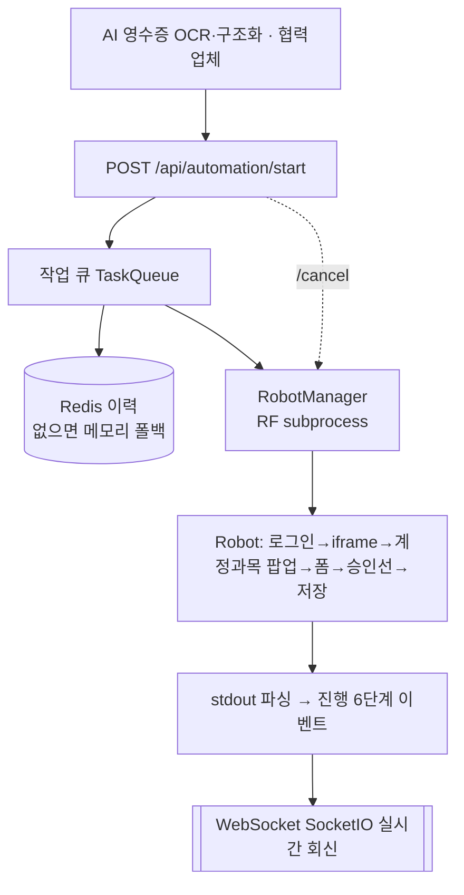
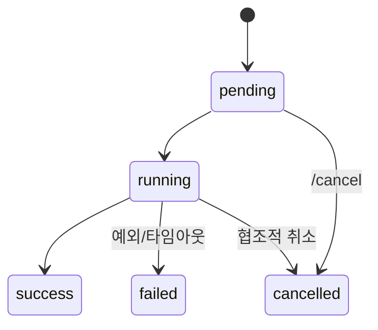

# 지출결의서 자동 상신 (RPA · 백엔드)

`Python` · `Flask` · `Flask-SocketIO` · `Redis` · `Robot Framework` · `Selenium`

| 한 줄 | 구조화된 지출 데이터를 받아 그룹웨어에 지출결의서를 자동 작성(실시간 진행률) |
|---|---|
| 역할 | 자동화 서비스(백엔드 + RPA) 핵심 기능 **직접 구현** |
| 핵심 역량 | 백엔드+RPA+AI 연계 엔드투엔드 · 실시간 진행 피드백 · 레거시 웹 자동화 안정화 |
| 상태 | 운영 중 |

> ⚠️ 그룹웨어 URL·기관명·사업자번호·[협력업체]명·계정(.env) 미포함. **외부 데모 골격에서 출발**했으므로 "최초 개발"로 표기하지 않으며, 핵심 기능(백엔드·RPA·매핑·안전장치)은 직접 구현. 아래는 백엔드 코어의 재현.

## 문제
그룹웨어 지출결의서를 담당자가 매 건 수기 작성하고 영수증 정보를 손으로 입력. 계정과목·승인선 선택이 팝업·iframe으로 번거롭고 오타·시간 소모가 컸다.

## 아키텍처


## 상태 전이


## 핵심 기술 / 안전장치
- Flask REST(`/start|status|result|logs|cancel`) + SocketIO 실시간 진행률
- **선택적 의존성 폴백**: Redis `ping` 실패 시 메모리 이력으로 graceful degradation
- **레거시 웹 자동화 안정화**: iframe 전환·팝업 처리 키워드 분리, 셀렉터 안정화
- `ExpenseDataMapper`: 지출 데이터 → RPA 변수(계정과목·승인선·참조문서)
- 실패 가시화: 타임아웃 kill, 협조적 취소, 실패 스크린샷+로그
- 자격증명은 `.env` 관리(코드 하드코딩 지양)

## 실행 가능한 재구현
```bash
cd impl
python automation_core.py      # 큐 적재 → 6단계 진행 → 성공 데모
python -m unittest -v          # 10개: Redis 폴백/매핑/성공/실패/타임아웃/취소
```
`impl/automation_core.py` — 작업 큐·상태전이·Redis 폴백·진행 이벤트·타임아웃/취소를 재현.
