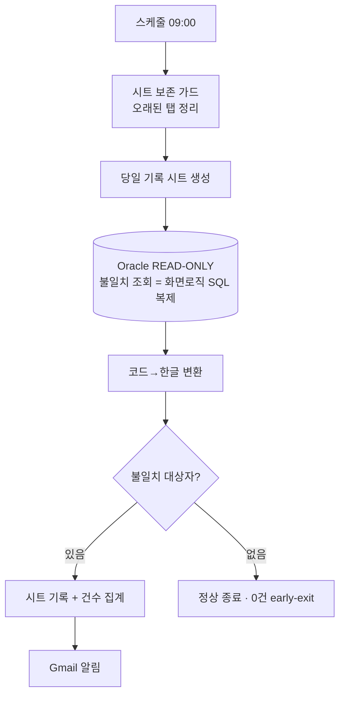
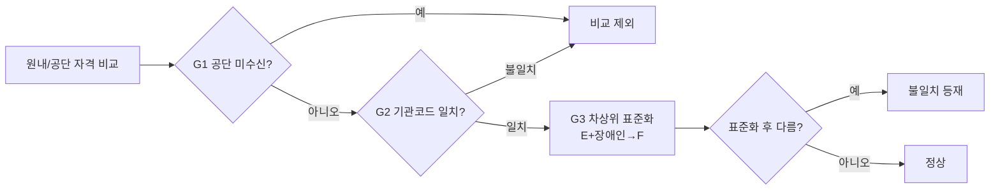

# 재원환자 불일치 자격확인 알림 자동화

`n8n` · `Oracle` · `Google Sheets` · `Gmail` · 데이터연계

| 한 줄 | 매일 원내 자격 vs 공단(NHIC) 자격을 자동 대조해 불일치 대상자만 통보 |
|---|---|
| 역할 | 요구분석 · 화면로직 SQL 복제 · 워크플로우 · 운영 안정화 **전담** |
| 핵심 역량 | EMR 화면 비즈니스룰의 SQL 재현 · 자동화 함정(거짓양성·시간대·중복) 방어 |
| 상태 | 운영 중 |

> ⚠️ 실제 [의료기관] EMR·환자정보·크리덴셜 미포함. 화면/테이블/서브밋 구조는 일반화, 데이터는 전부 합성. 아래 코드는 운영 로직의 **핵심 알고리즘 재현**.

## 문제
재원환자의 보험자격은 입원 중에도 변동한다. 담당자가 매일 EMR 자격 불일치 화면을 눈으로 확인해야 했고, 놓치면 수납·청구 오류로 이어졌다.

## 접근
원내 자격과 공단 자격을 매일 자동 대조하고 **불일치 대상자만** 시트·메일로 통보한다. 핵심은 **EMR 화면의 판단 로직을 SQL로 복제**해 "화면과 동일 기준"을 보장하는 것.

## 아키텍처 (일일 배치)


## 거짓 불일치 방지 3중 가드


## 핵심 기술
- 최신 공단결과 1건 선택: `ROW_NUMBER() OVER (PARTITION BY inst_cd, patient_id ORDER BY queried_at DESC) = 1`
- **거짓 불일치 3중 가드**: 공단 미수신 제외 · 다기관 혼입 차단 · 차상위 표준화
- **시트 보존 가드 3중**: 명명규칙 외 탭 보호 · 오늘 탭 보호 · 최소 1탭 보존
- **시간대 버그 해결**: `Asia/Seoul` 명시로 UTC 자정경계 날짜 어긋남 제거
- Fail-safe: 시트 정리 실패해도 알림 흐름 유지, 0건 early-exit

## 실행 가능한 재구현
```bash
cd impl
python eligibility_check.py       # 합성 데이터 대조 데모
python -m unittest -v             # 11개 단위테스트 (3중 가드 + 시트 보존)
```
`impl/eligibility_check.py` — 최신선택·3중 가드·코드→한글 변환·시트 보존 가드를 순수 파이썬으로 재현.
