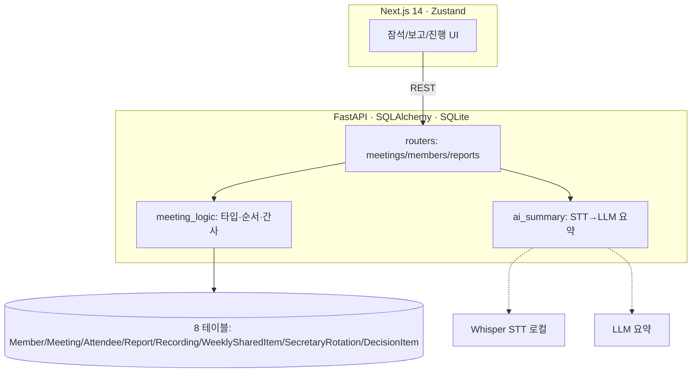
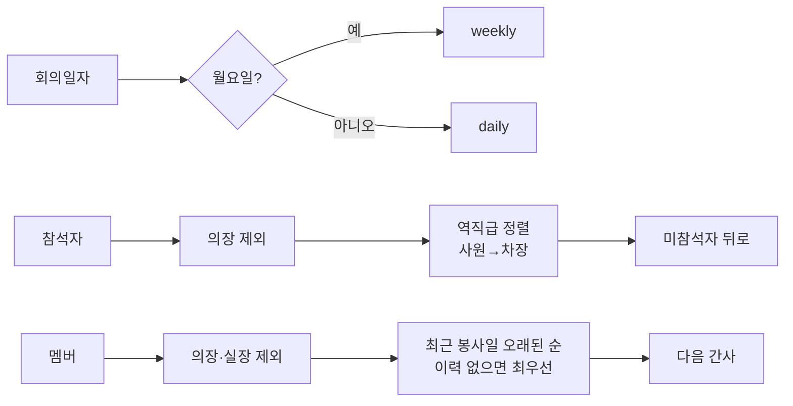

# 전산개발 회의 자동화 시스템 (풀스택 + AI)

`FastAPI` · `SQLAlchemy` · `Next.js 14` · `Zustand` · `Whisper(STT)` · `LLM`

| 한 줄 | 팀 일일/주간 회의의 참석·보고순서·보고입력·녹음 STT·AI 요약을 통합한 웹 시스템 |
|---|---|
| 역할 | 백엔드·프론트·도메인 로직·AI 연계 **직접 개발** (풀스택) |
| 핵심 역량 | FastAPI+Next.js 풀스택 · 회의 도메인 모델링(8테이블) · STT/LLM 파이프라인 |
| 상태 | 운영 |

> ⚠️ 실제 [의료기관]·서버IP·부서원 실명·DB 미포함(합성). 아래는 회의 도메인 로직의 재현.

## 문제
팀 회의(매일 09:00, 월요일 주간)의 참석 체크·보고 순서·보고 입력·회의록 작성이 수작업이었다.

## 접근
회의 진행을 웹으로 표준화: 참석 관리 → **직급 역순 보고 순서 자동 제안** → 보고 사전입력 → 녹음 STT → **AI 요약 초안**. 간사는 로테이션으로 공정 배정.

## 아키텍처


## 도메인 로직 (재현)


## 핵심 기술
- **회의 타입 판별**: 월요일=weekly, 그 외=daily
- **보고 순서**: 의장 제외 → 참석자 역직급 순 → 미참석자 후순위
- **간사 로테이션**: 이사장/실장 제외, 최근 봉사일이 가장 오래된(또는 이력 없는) 멤버 우선
- **AI 요약**: 녹음 → Whisper STT(로컬) → LLM 요약 초안(사람 검토 후 확정)
- 8개 ORM 테이블로 회의/보고/결정사항/녹음/간사이력 모델링

## 실행 가능한 재구현
```bash
cd impl
python meeting_logic.py        # 타입/보고순서/간사 추천 데모(합성 멤버)
python -m unittest -v          # 10개: 타입·보고순서·간사 로테이션
```
`impl/meeting_logic.py` — 회의 타입·보고 순서·간사 로테이션 도메인 로직을 순수 파이썬으로 재현.
